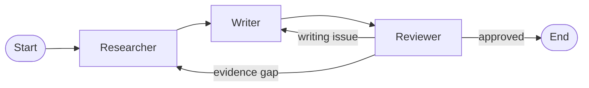

# SourceCraft Research

[🚀 Try the live demo](https://sourcecraft-research.streamlit.app/)

A source-aware, three-agent research assistant built with **LangGraph**, **Gemini**, DuckDuckGo
search, and **Streamlit**. It turns any topic into a cited Markdown brief, reviews its own work, and
routes problems to the agent best placed to fix them.

> This project began as a teaching prototype with a Researcher, Explainer, and Reviewer. The
> production version preserves that understandable workflow while adding reusable modules, source
> URLs, evidence-aware routing, a UI, tests, CI, and deployment.

## Why this is more than three prompts



The agents communicate through typed shared state. The Reviewer does not silently fix its own
findings: weak presentation returns to the Writer, while missing evidence returns to the
Researcher. Hard iteration limits prevent infinite loops.

## Features

- Live web search with deduplicated source URLs
- Cited research notes and Markdown reports
- Configurable audience, depth, and number of search results
- Structured Reviewer decisions: `approve`, `rewrite`, or `research`
- Downloadable final report and visible review history
- Replaceable LLM and search dependencies
- Offline unit and graph tests—no API key used in CI
- Streamlit Community Cloud and Docker deployment paths

## Quick start

Requirements: Python 3.11–3.14 and a Gemini API key from
[Google AI Studio](https://aistudio.google.com/app/apikey).

```bash
git clone https://github.com/Amr-Belal-77/sourcecraft-research.git
cd sourcecraft-research
python -m venv .venv
```

Activate the environment:

```bash
# Windows PowerShell
.venv\Scripts\Activate.ps1

# macOS or Linux
source .venv/bin/activate
```

Install and run:

```bash
pip install -e ".[dev]"
copy .env.example .env  # Windows; use `cp` on macOS/Linux
# Edit .env and add GOOGLE_API_KEY
streamlit run streamlit_app.py
```

The app opens at `http://localhost:8501`.

## Repository structure

```text
research_assistant/
├── agents.py       # Three agent nodes
├── config.py       # Environment-based settings
├── graph.py        # LangGraph assembly and routing
├── models.py       # Typed shared state
├── prompts.py      # Domain customization point
├── search.py       # Replaceable search adapter
└── text.py         # Provider response parsing
tests/              # Offline unit and workflow tests
docs/               # Customization, project ideas, and launch post
streamlit_app.py    # Web application
```

## Test and lint

```bash
ruff check .
pytest --cov=research_assistant --cov-report=term-missing
```

## Deploy

### Streamlit Community Cloud

1. Push the repository to GitHub.
2. In Streamlit Community Cloud, create an app from the repository.
3. Set the entry point to `streamlit_app.py`.
4. In the app's secret settings, add:

```toml
GOOGLE_API_KEY = "your-key"
```

5. Deploy, open the public URL, and run a real topic before sharing it.

### Docker

```bash
docker build -t sourcecraft-research .
docker run --rm -p 8501:8501 -e GOOGLE_API_KEY="your-key" sourcecraft-research
```

Never put API keys in source files, Git history, screenshots, or the deployed frontend.

## Customize it

Prompts are centralized in `research_assistant/prompts.py`, and search providers implement one
small protocol in `research_assistant/search.py`. See the full
[customization guide](docs/CUSTOMIZATION.md) and the ranked
[portfolio project ideas](docs/PROJECT_IDEAS.md).

When you are ready to publish, follow the [GitHub checklist](docs/GITHUB_CHECKLIST.md) and adapt the
[LinkedIn launch post](docs/LINKEDIN_POST.md).

For this repository, the strongest CV specialization is **AI Research Paper Scout**: use arXiv and
paper sources, compare methods and reported metrics, and measure citation validity against the
original papers.

## Known limitations

- DuckDuckGo results are search snippets, not full-page evidence.
- An LLM review reduces obvious issues but does not guarantee factual correctness.
- Public deployments need rate limiting and authentication before serving many users.
- High-stakes medical, legal, or financial use requires trusted sources and human review.

## Responsible use

Treat generated reports as research starting points. Open the cited pages, verify important claims,
and disclose AI assistance where appropriate.

## License

MIT
